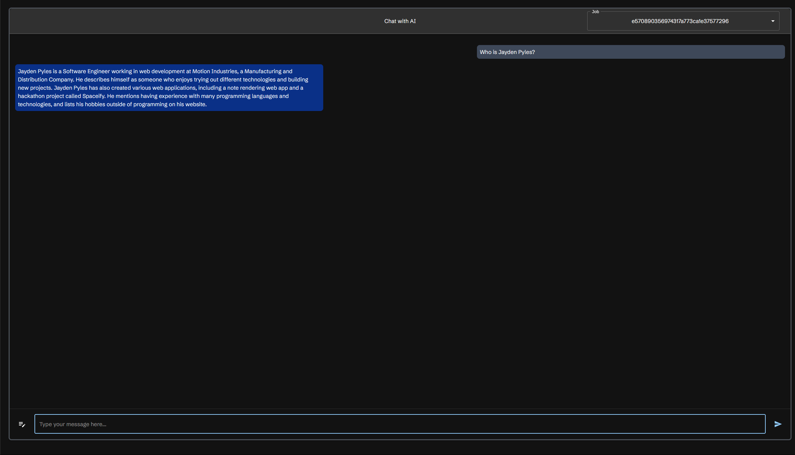

## Summary

The AI Integration allows you to ask questions about the jobs in the Job Table. Currently, it supports OpenAI's GPT models, and Ollama. This will use the text gathered by scraping jobs to answer your questions.



In the top right of the AI chat window, you can select what job you want to answer questions about. This will filter the chat to only include messages related to that job. Chats are attached to the job, so if you switch jobs, the chat will be updated to only include messages related to the new job. Clicking the `Clear Chat` button will clear the chat.

## Setup 

In the `docker-compose.yml` file, you can set the environment variables for the AI Integration.

### Open AI

To use OpenAI, you will need to set the `OPENAI_KEY` and `OPENAI_MODEL` environment variables. This can be done by adding the following to the `scraperr_api` service in the `docker-compose.yml` file:

```yaml
scraperr_api:
  environment:
    OPENAI_KEY: your_openai_api_key
    OPENAI_MODEL: gpt-4o
```

## Ollama

To use Ollama, you will need to set the `OLLAMA_URL` and `OLLAMA_MODEL` environment variables. This can be done by adding the following to the `scraperr_api` service in the `docker-compose.yml` file:

```yaml
scraperr_api:
  environment:
    OLLAMA_URL: http://ollama:11434
    OLLAMA_MODEL: phi3:latest
```