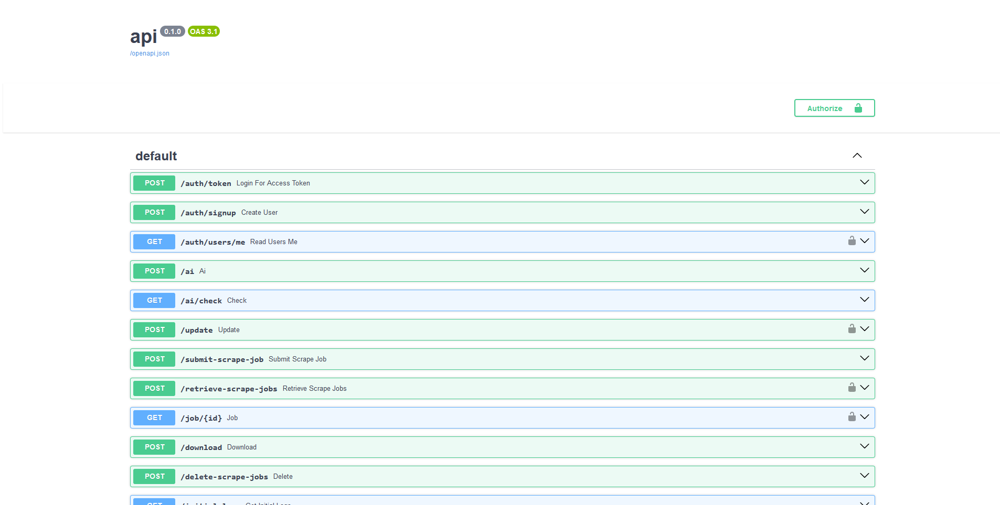

## Summary

The Scraperr API is a RESTful API that allows you to submit scraping jobs, view the status of the jobs, and download the results. This guide will cover how to use the API to submit a scraping job, and how to query the results. The docs for the API are viewable via Swagger UI at `http://localhost:8000/docs`.



## Submitting a Scraping Job

Using your favorite HTTP client, you can submit a scraping job to the API. Here is an example using `python`:

```python
import requests

url = "http://localhost/api/submit-scrape-job"
data = {
  "id": "",
  "url": "http://quotes.toscrape.com/",
  "elements": [
    {
      "name": "Quotes",
      "xpath": "//span[@class='text']",
      "url": "http://quotes.toscrape.com/"
    }
  ],
  "user": "",
  "time_created": "2024-11-07T17:13:55.448Z",
  "result": [],
  "job_options": {
    "multi_page_scrape": false,
    "custom_headers": {}
  },
  "status": "Queued",
  "chat": ""
}

response = requests.post(url, json=data)
print(response.json())
```

Which should return a response like this:

```json
{
  "id": "32d9012927004bf2b20965be5520ec13"
}
```

## Checking the Status of a Job

You would want to check the status of a job to see if it has been completed, or if there are any errors. You can do this by making a `GET` request to the `/api/job/{id}` endpoint. This will return the Job object from the database. Here is an example using `python`:

```python
import requests


url = "http://localhost/api/job/32d9012927004bf2b20965be5520ec13"
response = requests.get(url, headers={"Authorization": "Bearer <can_be_no_token_if_not_logged_in>"})
print(response.json())
```

## Updating a Job

You can update a job by making a `POST` request to the `/api/job/{id}` endpoint. This will return the updated Job object from the database. Here is an example using `python`:

```python
import requests

url = "http://localhost/api/update"
data = {
    "ids": ["32d9012927004bf2b20965be5520ec13"],
    "field": "status",
    "value": "Completed"
}

response = requests.post(url, json=data, headers={"Authorization": "Bearer <can_be_no_token_if_not_logged_in>"})
print(response.json())
```


## Deleting a Job

You can delete a job by making a `POST` request to the `/api/delete-scrape-jobs` endpoint. This will deleted the ids passed in the `ids` field from the database. Here is an example using `python`:

```python
import requests

url = "http://localhost/api/delete-scrape-jobs"
data = {
    "ids": ["32d9012927004bf2b20965be5520ec13"]
}

response = requests.post(url, json=data, headers={"Authorization": "Bearer <can_be_no_token_if_not_logged_in>"})
print(response.json())
```
