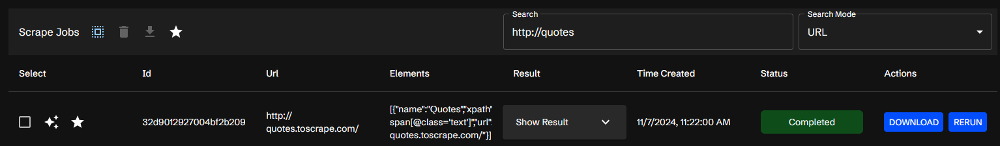
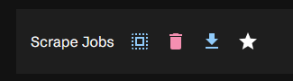
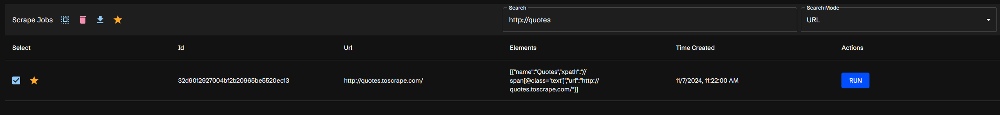

## Summary

The Job Table is a table of all of the scraping jobs that have been submitted to the Scraperr API. This table is updated in real-time as jobs are added, completed, or fail.

## Filtering the Table

The table can be filtered by the id, url, status. Using the search bar and the dropdown menu to select the field, you can search for any of these fields.

## Job Actions

Using the actions section of the table, you can:

- Select all jobs
- Delete selected jobs
- Download the selected jobs as a CSV file
- View favorited jobs

## Favoriting Jobs

Jobs can be favorited by clicking the star icon in the far left of the table. This will add the job to the favorited jobs section. This will allow you to view all of the favorited jobs by clicking the "Favorited Jobs" button in the top left of the table. From there, you can unfavorite a job by clicking the star icon again.

This allows you to save jobs that you may want to come back to later.

## AI Integration

The Job Table also has an AI integration, which allows you to ask questions about the jobs in the table. To use this, click the `Chat` button in the far right of the table. This will open a chat window where you can ask questions about the jobs in the table.

