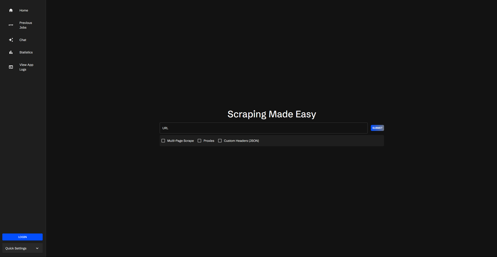
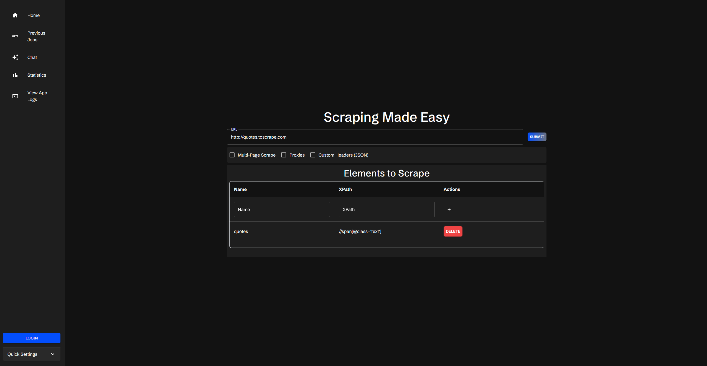
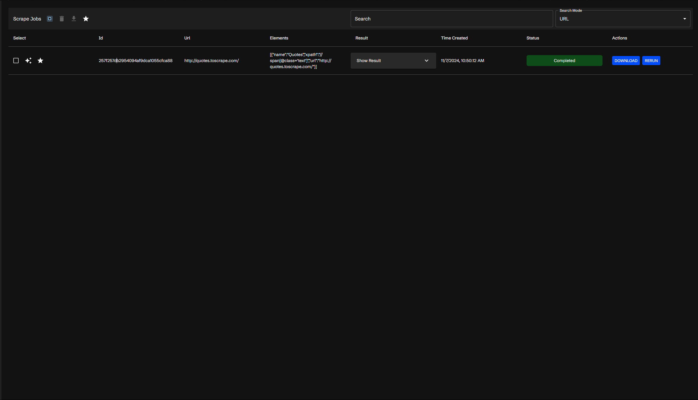
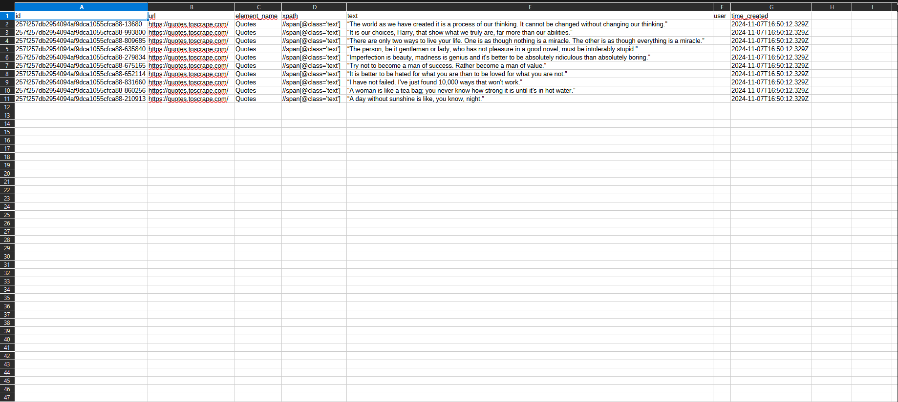

## Summary

What is Scraperr? Scraperr is a self-hosted web scraping service that allows you to scrape websites and save the data to a database. The purpose of this application is to provide a simpler way to scrape websites, without all of the setup and configuration that you get with a tool like Puppeteer. The frontend of the app has been decoupled from the API which allows you to submit scraping jobs within other applications, or setup your own application to use the API.

## Installation

1. Clone the repo:

```bash
git clone https://github.com/jaypyles/Scraperr.git
```

2. Set up the environment variables in the `docker-compose.yml` file. Note: all of these variables do work with the default values, but you may want to change them.

```yaml
scraperr:
  environment:
    - NEXT_PUBLIC_API_URL=http://scraperr_api:8000 # this is the URL of the Scraperr API
    - SERVER_URL=http://scraperr_api:8000 # this is the url of the Scraperr API container 
scraperr_api:
  environment:
    - SECRET_KEY=your_secret_key # used to encode authentication tokens (can be a random string)
    - ALGORITHM=HS256 # authentication encoding algorithm
    - ACCESS_TOKEN_EXPIRE_MINUTES=600 # access token expire minutes
```

3. Use the `Makefile` to start up the containers:

```bash
make up
```

After everything starts up, you can access the Scraperr API at `http://localhost` (or whatever port you expose for the frontend) and you should see this page:



## Submitting a Scraping Job

The first step to submitting a scraping job is to enter in the URL of the website you want to scrape. When you enter in the URL, you will see a table appear, where you can fill in the selectors for the data you want to scrape. You can name your elements and provide an `xpath` for the element you want to scrape.



## Advanced Options

For advanced configuration options such as multi-page scraping, custom headers, and proxy settings, please refer to our [Advanced Options](/guides/advanced-options) guide.

## Job Submission

Upon hitting submit, your job will be added to the queue and you will be prompted to go to the table of jobs.



From here, you have a few options, which will be covered more in the [Job Table Guide](/guides/job-table). But from here the status of the job will be displayed, and once it has been marked as `completed`, you can view the results, by hitting the "Download" button. This will download the data as a CSV file, which you can then view in your spreadsheet application of choice.



## What's Next?

Now that you have some data, you can query it in your own application, or even use the [AI integration](/guides/ai) to answer questions about the data.


