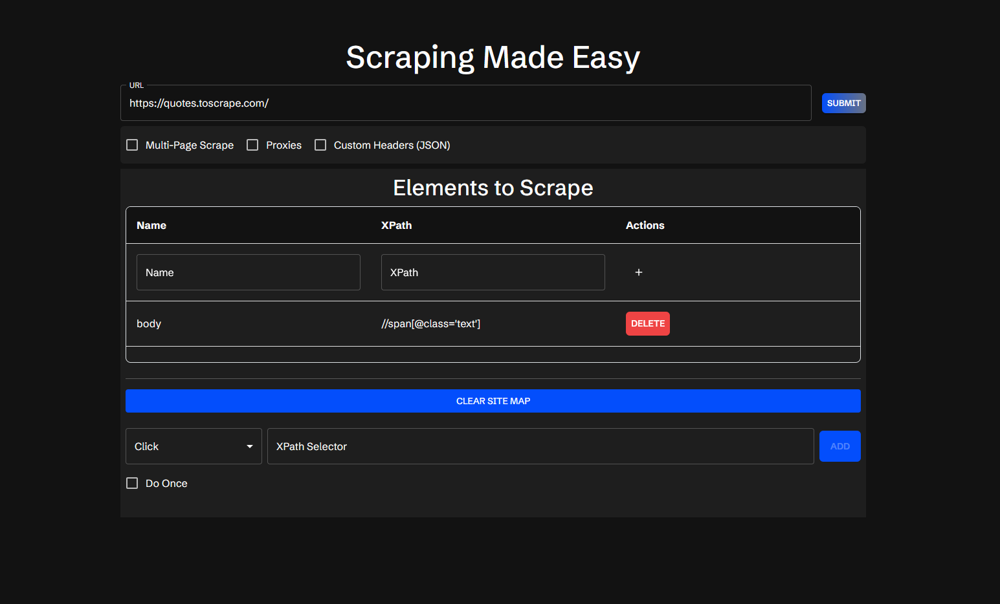
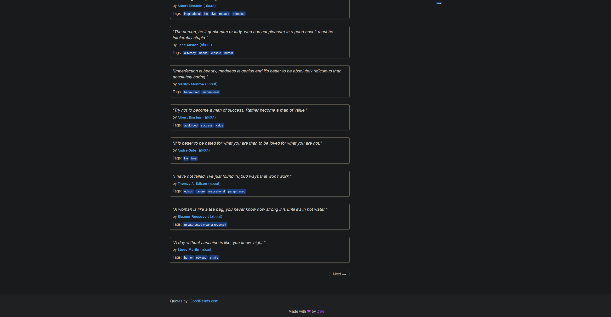
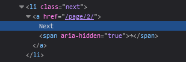
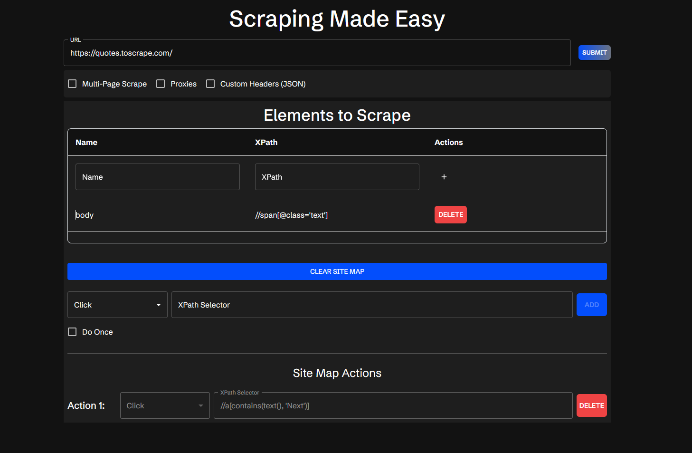
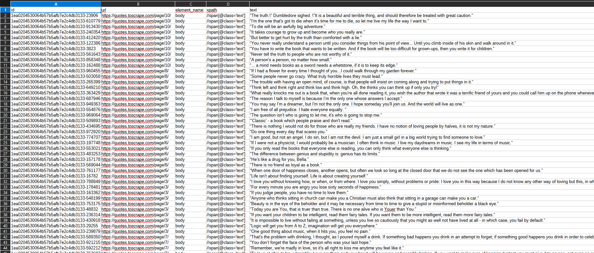

One of the features of Scraperr is to be able to create a series of actions while scraping a website. This is useful if you want to scrape a website, but the website requires you to click through a few pages to get to the data you want, or you need to press some sort of "next" button to get to the next page of data.

To do this you can press the "Create a Site Map" button below the element table. This will allow you to create a series of actions that will be performed while scraping the website. Currently you can only either click a button or fill in an input field. Each action requires an `xpath` selector, that will be used to find the element to click or fill.

For instance on the site [quotes.toscrape.com](https://quotes.toscrape.com/), if you wanted to scrape all of the quotes on the site, you would either be required to create 10 jobs for each page, or you could press the "next" button on each page.

Here we can see that the "next" button on the site has an `xpath` selector of `//a[contains(text(), 'Next')]`. We can use this selector to click through all of the pages of the site.

Now that we know what the `xpath` selector is for the "next" button, we can add an action to click the button. Once we have added the action, we can hit submit, and the site map will be added to the job.

There is another option per action, which is the "Do Once" option. This will only perform the action once, rather than on every page. This is useful if you want to click a "next" button, but only on the first page, or you only want to fill in an input field once.

After the job is completed you can see that we have scraped all of the quotes on the site, and not just the first page.

